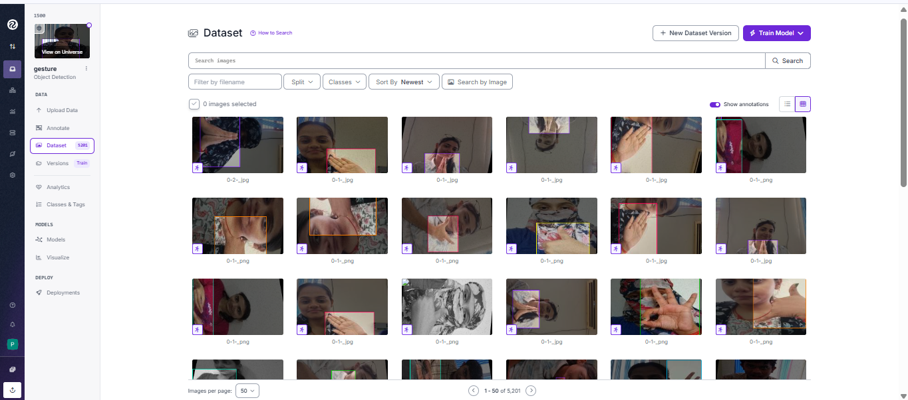
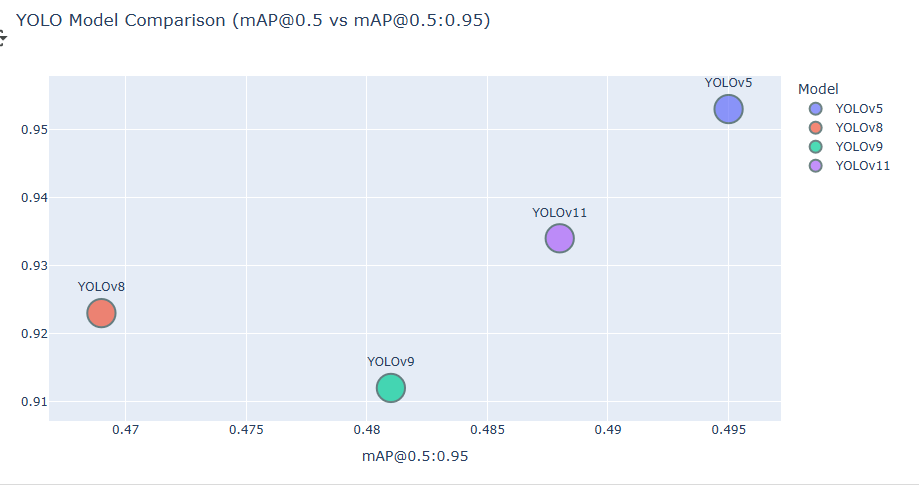
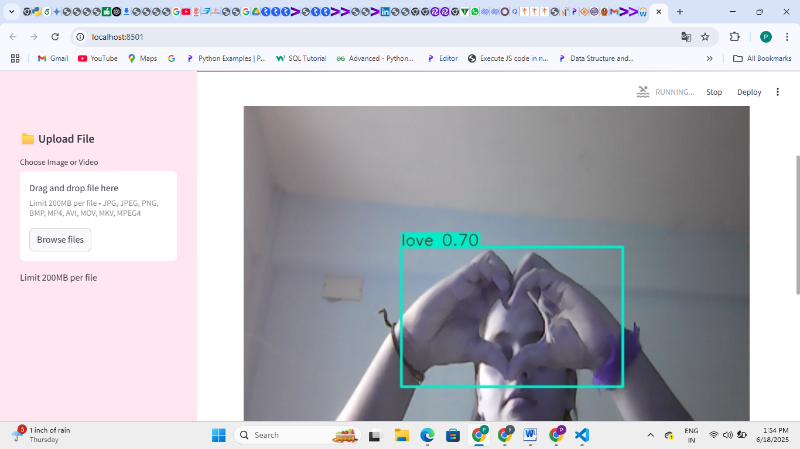

# Gesture-Genie-Real-Time-ISL-Recognition-with-Voice-Output-


🚀 A Computer Vision project for real-time **Indian Sign Language (ISL) Recognition** using **YOLO, OpenCV, and Deep Learning**.  

---

## 📖 Project Overview  
- Developed as part of my **M.Sc. Computer Science Thesis (2025)**.  
- Objective: Bridge the communication gap between **deaf/mute community** and general society.  
- Built a real-time ISL recognition system with custom dataset, preprocessing, and model training.  

---

## 🔧 Tech Stack  
- **Languages**: Python  
- **Frameworks**: PyTorch, OpenCV, Streamlit  
- **Models**: YOLOv5 → YOLOv11  
- **Tools**: Google Colab, Roboflow, GitHub  

---

## 📂 Project Features  
✔️ Custom Indian Sign Language dataset  
✔️ ROI extraction & image preprocessing pipeline  
✔️ Data augmentation (1000+ images per class)  
✔️ Real-time gesture detection using YOLO  
✔️ Text-to-Speech integration for recognized gestures  

---

## 📊 Workflow  
1. **Data Preprocessing** – ROI extraction, resizing, normalization  
2. **Annotation & Augmentation** – Roboflow + Python scripts  
3. **Model Training** – YOLOv5 to YOLOv11  
4. **Evaluation** – Accuracy, Precision, Recall, F1-score  
5. **Deployment** – Streamlit app with camera input  

---

## 📸 Screenshots  


  
*ROI extraction for gesture images*  

  
*Model training results*  

  
*Gesture detection in real-time*  

---

## 🚀 How to Run Locally  
```bash
git clone https://github.com/poojakumari22p/gesture-genie.git
cd gesture-genie
pip install -r requirements.txt
streamlit run app.py
